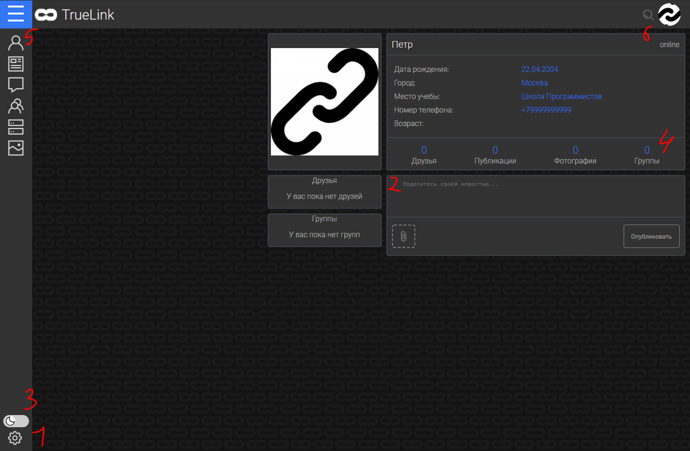

**Документация пользователя**
==========================================

***************
Введение
***************

TrueLink - это социальная сеть, объединяющая в себе несколько ключевых для современного мира возможностей:
************************************************************************************************************
- Общение с людьми при помощи личных текстовых сообщений
- Общение с группой людей на общем сервере
- Публикация творчества в группы
- Получение актуальных новостей с помощью ленты

***********************
Первый вход на сайт
***********************

Будущему пользователю сайта необходимо пройти быструю регистрацию чтобы начать пользоваться сайтом.
************************************************************************************************************

Фамилию пользователя не будет видно при первом заходе на сайт, но эту функцию можно отключить в настройках приватности\ :sup:`1`.
************************************************************************************************************************************

После регистрации пользователь увидит свою страницу, которую ему ещё предстоит заполнить. Пользователь может:
****************************************************************************************************************
- Опубликовать пост (как с картинкой, так и без)\ :sup:`2`
- Поменять цветовую тему для сайта\ :sup:`3`
- Посмотреть список своих друзей\ :sup:`4`, фотографий, групп
- Воспользоваться боковым меню для перехода в разные разделы сайта\ :sup:`5`
- Воспользоваться поисковиком для нахождения людей, групп и серверов\ :sup:`6`

************************
Страница новостей
************************

Вы можете посмотреть список всех групп в блоке справа.
*********************************************************

Когда вы подпишитесь на группу, у вас в ленте начнут появляться посты из этой группы.
***************************************************************************************

Нажав на кнопку "Показать все группы" вы получите список ваших групп, а также возможность создать группу самому.
*******************************************************************************************************************

*******************
Страница чатов
*******************

Вы можете найти любого пользователя и отправить ему сообщение, а также заблокировать тех пользователй, сообщение от которых вы получать не желаете.
*****************************************************************************************************************************************************

*******************
Страница друзей
*******************

На странице друзей вы можете написать пользователю, состоящему в вашем списке друзей.
******************************************************************************************

*******************
Страница серверов
*******************

На этой странице вы можете посмотреть список серверов, в которых состоите, а также создать сервер.
********************************************************************************************************

*******************
Права в группах
*******************

На страницах групп, вы, как админ, можете удалять посты других пользователей, изменять настройки группы (поменять картинку, сменить название, принять участников в случае, если группа закрытая).
*****************************************************************************************************************************************************************************************************************

Как пользователь, вы можете загружать посты.
*************************************************

Как создатель, то же что и админы, а также удалить группу.
***************************************************************

*******************
Права на серверах
*******************

На серверах права такие же как и в группах, только вместо постов здесь сообщения. Также только админы и создатель могут создавать чаты.
******************************************************************************************************************************************

